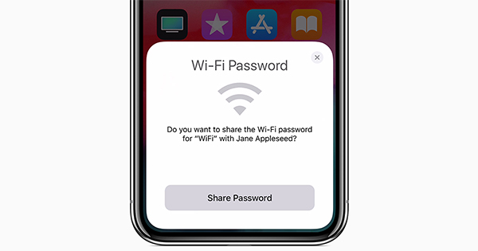

After having been with the same internet provider for almost 8 years it was time for a change. Giving the amount of outages over the last few months, no attempts in terms of improving customer loyalty (they could have offered me a new router model through the years) and in general no actions from their side in years whatsoever, the decision made sense.

4th of June a technician activates the connection in my apartment. Having only had bad experiences with Telekom in the past, when my parents first got us hooked up, didn’t let me shake the feeling something would go wrong.

It didn’t. The technician showed up right within the scheduled time frame, conveniently precise between 8am and 1pm. One quick check in my apartment, one in the basement and one at a control box outside the house, that was it.

“Just plug in the router and everything should be taken care of.”

And once again I got surprised. This is exactly what happened. I was online in no time.
Configuring the WiFi to my needs includes changing the SSID to something more appropriate and making sure we cater for 2,4Ghz devices namely my Sonos One speakers.

Visiting [http://telekom.de/einrichten](http://telekom.de/einrichten) got me to a simple web interface. Logged in with my device password I can easily access all relevant settings.
To my surprise the Speedport Smart 2 decides whether to use 2,4Ghz or 5Ghz depending on the client device.

Hitting save and waiting a few seconds was all that was left to do.

I have multiple devices in my household.
- iPhone 7 Plus
- iPad Pro 2018
- MacBook Pro
- 2 x Sonos One

Thanks to the ability to share passwords between Apple devices getting the iPhone and iPad into the same network as the MacBook was basically frictionless, almost so with my Sonos.

For a second I thought I could get the setup over on the new network without plugging in any cables. Unfortunately I couldn’t avoid moving one speaker over to the router and connect via Ethernet cable. For the second one tho a push on the power button was enough to bring it online.

I thought writing this one would be interesting. We are more connected and dependent on the internet than ever. I never had that many devices in my house either. Yet the actions necessary to hook up all that felt simpler and more straight forward than ever. The concept is simple: don’t make me type long passwords over and over again and detect my devices if possible.

It is 2019 and I am very happy with my setup. 2.4Ghz & 5Ghz support at the same time, better WiFi coverage and stable internet connection.

WU-TANG LAN - EPISODE II

