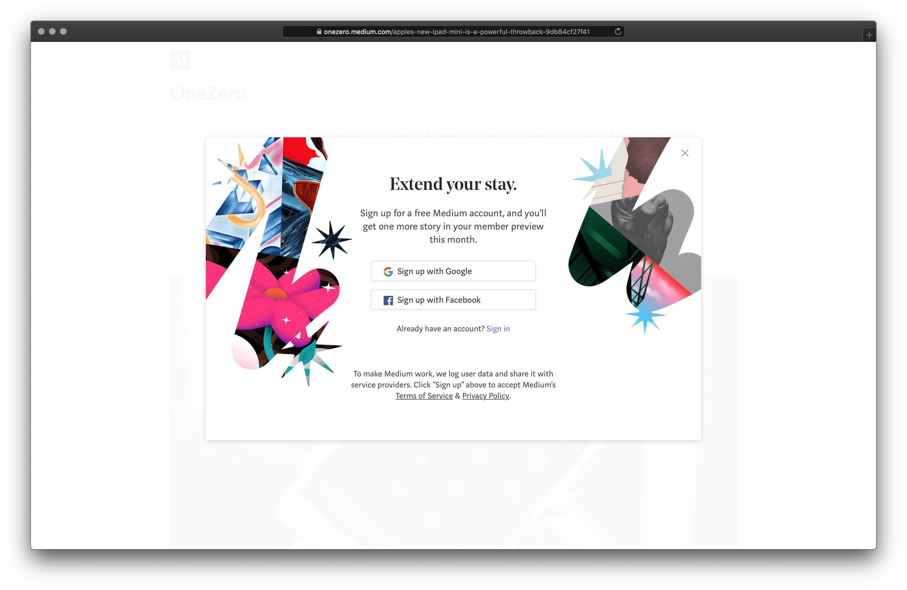
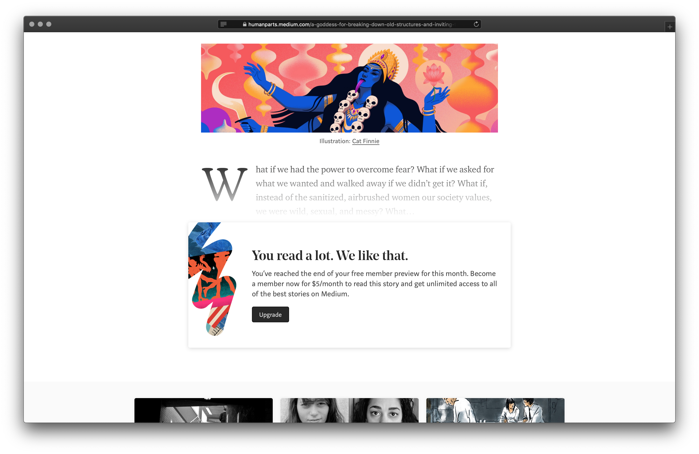

Over the last few weeks I came across more and more people reminding me about the whole content ownership debate once again. While platforms like [Medium](https://medium.com) allow basically everyone to publish content in mere minutes you'll always be at the mercy of these platforms. What doesn't sound like a big deal at first can become quite an issue later.

Thinking back at especially this platform's beginnings I remember having been in awe about their incredible amount of care for typography, readability and legibility. The content and displaying the content in its best way was the heart of this platform. The pages were mainly well grafted typography surrounded by white space.

Like a lot of platforms with good intentions the intentions get overshadowed by money and what people with money think is good for their development.

I've published a few articles on [Medium](https://medium.com) myself, mainly because it was in its early days, it was a good amount of hype going on around it plus I was in yet another state of redesigning my blog – iteration 500.
But no matter what excuse I make up for not having had my shit together here we have it: It's early 2019 and I cannot read a story on Medium without getting prompted to some action by one of their pop-ups. Hell, after reading a bit I cannot even do this anymore because I've overextended my stay as a free user.

Wait!? They hide content, I have written for anyone to read and learn from, from people who do not want or cannot pay money for an account. This was never my idea of creating and sharing knowledge on the web.

I'm not saying it's wrong the company behind this platform is trying to make money and pay their bills. I don't agree on them doing this using my content and neither should you.

From hiding content behind a pay wall to completely removing entire platforms – you're at a company's mercy.
[Killed by Google](https://killedbygoogle.com) displays best how quickly a product can lose its relevancy in todays digital age.
You mostly do not know about a platform's goals, road map, business plan and / or changes to either of them. What once was the perfect app, set up for success, might not be there anymore one year later. Sure you will get the possibility to download your content before they turn off the lights. It's not like we're losing 12 years of musical data out of a sudden.

Yes, not everyone is a designer and / or developer with the means to create their own publishing platform. But shouldn't we, the people who know how to create on the web, like it's 1999, walk on the forefront and show how it can be done(again)?
Shouldn't we use our power and privilege to create meaningful, helpful and honest experiences without the added extra noise of pop-ups, paywalls and questionable tracking practices?
Even if it doesn't feel like much in the beginning, to create on your own terms, to own your content and to decide what is or isn't gonna happen to it, it for sure will when the next hyped platform reveals questionable decisions forced upon their users.

It's just a matter of time.