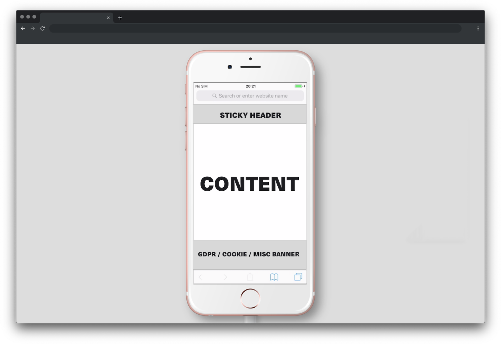

Today I once again got asked to implement a sticky header on a mainly marketing driven website. So I wondered, why do people insist on following this pattern?

Let's refresh our minds real quick. What purpose does a sticky header serve? The header sticks to the top of the page while scrolling down reading / viewing the content of the page and thereby provides easy access to further navigational items.

Since long single page apps have become quite a common thing on the web I can understand why this pattern surfaced and why it can provide benefits to the user. Rather than scrolling back up all the way to reach the navigation or having to open an otherwise hidden layer it's with you all the way, all the time.

Now I can already hear the marketers and growth hackers cry from the back of their seats, "But what about the CTA? You forgot that's the perfect spot for a CTA!". To you I simply say "Go fuck off!"
Once a sticky header has lost its navigational purpose it's out the window. There is no reason to keep this thing hanging above the content. Not only might it possibly be distracting, depending on how it is designed, it most definitely takes up screen real estate.

And let's not be naive here by looking at our shiny iPhone XS Max screens going "That's not a real problem".

This is an iPhone 6s simulator. I've added a sticky header and an area reserved for a banner. The square like sliver in the middle is the area that's left for the actual important stuff, your content. This might very well be the average screen size of your users depending on the sector you're operating in.

There are pages over pages which with every of their sections try to lure you into buying their product. Not only is it common to put a CTA next to basically every message that describes your product, now we also have to use sticky navigations to slap another "BUY ME NOW" layer right into your user's face. STOP THIS BULLSHIT!

> Colleague X "It's like street harassment, but online."

What happened to honest, transparent product descriptions? What happened to quality work and outstanding product features, which makes the user WANT to buy into your product?
To all fellow web engineers, designers and product managers out there I say, question these kind of decisions. We are the ones implementing these bad habits and thereby create room for them to spread.
